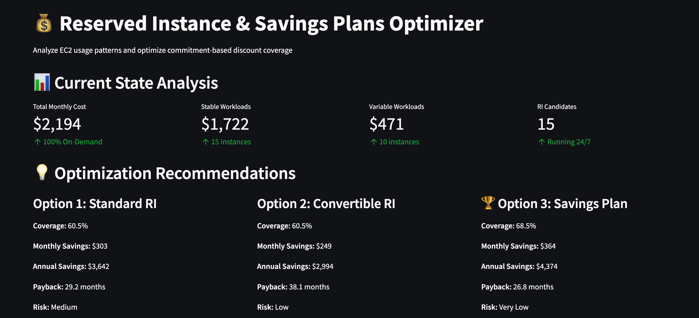
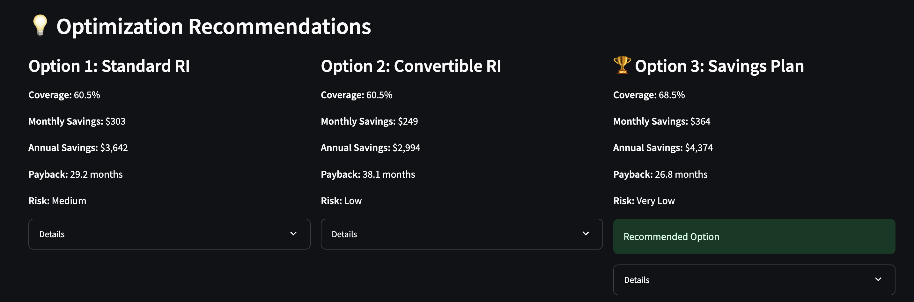
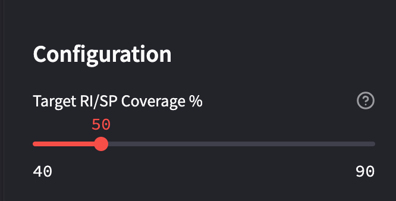
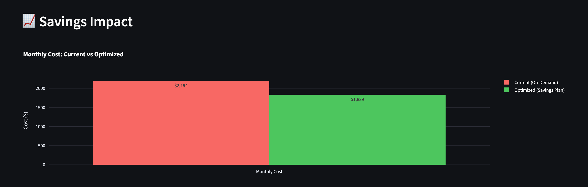
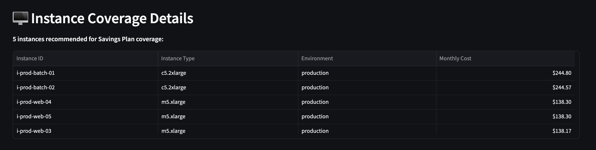

# FinOps Command Center 💰

> **AWS cost optimization platform built by a FinOps Certified Practitioner**

Interactive dashboard for analyzing cloud spending patterns, detecting anomalies, and optimizing AWS costs. Works with both enterprise-scale data and real AWS accounts.


---

## What This Does

This is a working FinOps platform I built to demonstrate cost management at scale. It analyzes AWS spending data and gives you the insights you actually need - where money's going, what's trending up, and when something looks off.

**Key features:**
- Real-time cost visibility across services and accounts
- Anomaly detection (flags spending spikes >20% above baseline)
- Multi-account analysis for organizational chargeback
- RI/Savings Plans optimization with interactive scenario modeling
- Toggle between enterprise-scale demo ($4.2M) and personal AWS data ($0.64)

**Why two data modes?**  
My personal AWS account has minimal spend ($0.64 over 3 months), which is great for learning but doesn't show what this platform can do at scale. So I built realistic simulated data (~$4.2M total) that follows actual AWS spending patterns - EC2-heavy, weekend dips, gradual growth. Best of both worlds: authenticity + real-world scale.

---

## Why I Built This

After years in cloud engineering, one thing drives me crazy: **manual, repetitive tasks that should be automated.**

I've seen FinOps teams spend hours every week:
- Manually exporting CSV files from AWS Cost Explorer
- Copy-pasting numbers into spreadsheets
- Creating static reports that are outdated the moment they're shared
- Sending stakeholders raw billing data they can't interpret

**This is backwards.** We automated infrastructure with IaC. We automated deployments with CI/CD. Why are we still doing FinOps manually?

This dashboard represents how I think FinOps should work:
- **Automated data ingestion** - no more manual CSV exports
- **Real-time visibility** - data updates continuously, not monthly
- **Stakeholder-friendly** - executives see trends and anomalies, not raw bills
- **Self-service** - teams can explore their own costs without waiting for reports

I don't just want to show stakeholders bills. I want to give them **insights they can act on**, delivered through dashboards they actually understand.

That's the automation mindset I'm bringing from cloud engineering into the FinOps world.

## Screenshots

### Enterprise Scale Analysis ($4.2M)

**Key performance indicators:**


**Daily spend tracking with trend analysis:**


**Service-level cost breakdown:**


The enterprise view shows realistic AWS spending patterns - EC2 dominates at 42.5% (compute-heavy workload), RDS at 22.4% (database costs), then storage, networking, and caching services. Weekend dips and daily variation match real production environments.

---

### Personal AWS Account ($0.64)

**My actual AWS account metrics:**


**Real spending growth over 3 months:**


**Actual service breakdown:**


You can see exactly what I'm using - primarily Secrets Manager ($0.61) for credential storage, some AWS tax charges ($0.03), tiny amounts of S3 storage, and API Gateway usage. This is what a learning/development account actually looks like.

---

## RI/Savings Plans Optimizer

**New Feature: Commitment-Based Discount Analysis**

One thing that frustrated me about manual FinOps was watching teams leave money on the table by running everything On-Demand. Reserved Instances and Savings Plans can cut costs by 30%+, but most teams don't optimize coverage because the analysis is tedious. So I built an automated RI/SP recommendation engine.

**How it works:**

The optimizer analyzes 90 days of EC2 usage to identify stable baseline workloads (instances running 24/7) versus variable usage patterns. It then calculates optimal coverage for three scenarios: Standard RIs, Convertible RIs, and Compute Savings Plans. Each recommendation includes savings projections, payback period, risk assessment, and flexibility tradeoffs.

**Dashboard overview:**


The dashboard shows we're currently spending $2,194/month on 25 EC2 instances running 100% On-Demand. The analysis identified 15 production instances as excellent RI candidates (stable 24/7 workloads) and 10 dev/test instances that should stay On-Demand (they shut down nights and weekends).

**Three optimization scenarios:**


Each option shows different tradeoffs between savings, flexibility, and risk. Standard RIs offer highest upfront savings but lock you to specific instance types. Convertible RIs give flexibility to change instance types but slightly lower discounts. Savings Plans (recommended) provide the best balance—strong savings with maximum flexibility across instance families and regions.

**For this fleet:**
- **Current state:** $2,194/month, 100% On-Demand
- **Optimized with Savings Plans:** $1,829/month
- **Monthly savings:** $364 (17% reduction)
- **Annual savings:** $4,374
- **Payback period:** 27 months

**Interactive coverage adjustment:**


The sidebar slider lets you adjust target RI/SP coverage from 40-90%. As you move the slider, all recommendations update in real-time—monthly savings, annual projections, payback periods, and which specific instances to cover. This helps model different risk scenarios (aggressive 90% coverage vs conservative 50% coverage).

**Before/after cost impact:**


Visual comparison showing current On-Demand cost versus optimized cost with Savings Plans. The $365/month difference adds up to over $4,300 annually—money that could fund other infrastructure improvements.

**Instance-level recommendations:**


The tool doesn't just tell you "buy Savings Plans"—it shows exactly which instances to cover. For this environment, covering the two c5.2xlarge batch processing instances and three m5.xlarge web servers gets you 68% of maximum savings while keeping variable workloads flexible.

**What I learned building this:**

This was the trickiest part of the project so far. AWS pricing is complicated—Standard RIs vs Convertible RIs vs Savings Plans vs Spot vs On-Demand, each with different commitment terms, payment options, and discount percentages. I had to build logic that analyzes 90 days of usage patterns, identifies consistency (is this instance running 24/7 or just sometimes?), calculates break-even points, and ranks instances by cost to maximize savings with minimal coverage.

The interactive slider was fun to build—watching the recommendations update in real-time as you adjust coverage percentage makes the tradeoffs really clear. Should you commit to covering 90% of stable workloads for maximum savings, or play it safe at 50% in case usage patterns change? The tool lets you model both.

**Why this matters for FinOps:**

Most FinOps teams do RI/SP analysis in spreadsheets. They export billing data, pivot it seventeen different ways, manually calculate discount percentages, and email static recommendations to engineering. A month later, nothing's happened because the analysis is already outdated.

This approach automates the entire workflow. Point it at your AWS billing data, adjust the coverage slider to your risk tolerance, and get instant recommendations with projected savings. Engineering teams can explore different scenarios themselves rather than waiting for the FinOps team to run another analysis.

---

## Tech Stack

**Built with:**
- **Python** - Data processing and business logic
- **Pandas** - AWS billing data transformation
- **Streamlit** - Interactive web dashboard
- **Plotly** - Professional-grade visualizations
- **AWS Cost Explorer** - Real billing data source

**Why these tools?**  
Streamlit gets you from idea to working dashboard incredibly fast, and Plotly makes charts that actually look good. Perfect combo for a portfolio project that needed to work *and* look professional.

---

## FinOps Concepts Demonstrated

This project isn't just about making charts - it implements real FinOps principles:

**Cost Allocation & Visibility**
- Service-level and account-level spend breakdown
- Multi-account organizational analysis
- Shows exactly where dollars are going

**The Prius Effect**
- Real-time visibility changes behavior (that's the whole point!)
- Daily trend tracking with baseline averages
- Teams can't optimize what they can't see

**Anomaly Detection**
- Automated alerts when spend jumps >20% above 7-day average
- Catches issues before they become problems
- No more surprise bills at month-end

**Commitment-Based Discount Optimization**
- RI/Savings Plans coverage analysis and recommendations
- Risk-adjusted scenarios with payback calculations
- Instance-level coverage targeting

**Metric-Driven Optimization**
- KPIs: Total spend, daily average, service count, account count
- Data-driven decisions instead of gut feelings
- Track improvements over time

---

## How to Run This
```bash
# Clone the repo
git clone https://github.com/tayo214/finops-command-center
cd finops-command-center

# Install dependencies
pip install -r requirements.txt

# Run the main dashboard
streamlit run src/app.py

# Or run the RI/SP Optimizer
streamlit run src/ri_dashboard.py
```

The dashboard opens in your browser at `http://localhost:8501`.

**Want to use your own AWS data?**  
Export from AWS Cost Explorer as CSV, drop it in the `data/` folder, and toggle to "Personal Account" view.

---

## Project Structure
```
finops-command-center/
├── src/
│   ├── app.py                    # Main cost dashboard
│   ├── ri_optimizer.py           # RI/SP recommendation engine
│   ├── ri_dashboard.py           # RI/SP interactive dashboard
│   ├── prepare_data.py           # Data processing
│   └── generate_ec2_data.py      # EC2 usage data generator
├── data/
│   ├── simulated_aws_data.csv    # Enterprise demo data
│   ├── simulated_ec2_usage.csv   # EC2 usage patterns (90 days)
│   ├── ec2_inventory.csv         # Instance fleet inventory
│   ├── ri_sp_pricing.csv         # RI/SP pricing reference
│   ├── aws_billing_services.csv  # My real AWS data
│   └── aws_billing_accounts.csv  # My real AWS data
├── screenshots/                  # Dashboard screenshots
└── README.md
```

---

## What I Learned Building This

**The hard parts:**
- AWS Cost Explorer CSV format is... quirky. Service names in column headers, costs in rows, dates all over the place. Took some creative Pandas work to wrangle it into something usable.
- Getting service names to show on charts when you have 4 services vs. 10 services vs. tiny dollar amounts - had to make the visualizations adapt to wildly different scales.
- AWS pricing complexity - Standard RIs vs Convertible RIs vs Savings Plans, all with different discount rates, payment options, and flexibility levels. Building logic to compare them fairly required understanding the actual financial tradeoffs.
- Balancing "this looks professional" with "this doesn't take 6 months to build."

**The fun parts:**
- Seeing realistic patterns emerge from the simulated data - weekend dips, gradual growth, EC2 dominance. Felt like watching a real company's spending.
- Building the interactive RI optimizer slider - watching all the numbers update in real-time as you adjust coverage percentage was surprisingly satisfying.
- Building something that could actually handle enterprise-scale analysis (even if it's simulated).
- Making a dashboard that doesn't look like every other tutorial project out there.

**What I'd do next:**
- Add forecasting with variance analysis (predict next month's spend)
- Build out unit economics tracking (cost per customer, transaction, etc.)
- Tagging compliance dashboard with drift detection
- Deploy to Streamlit Cloud for live demos

---

## About Me

**Tayo Salako**  
FinOps Certified Practitioner

I passed the FinOps certification because I'm genuinely interested in how cloud costs work and how to optimize them. This project demonstrates what I learned - not just theory, but actual working code that solves real problems.

**Connect with me:**
- **LinkedIn:** https://www.linkedin.com/in/babatunde-salako-7752a1391/
- **GitHub:** https://github.com/tayo214
- **Email:** babatunde.salako@gmail.com

---

## Certification


---

## License

MIT - feel free to use this for your own FinOps learning!

---

**Built by Tayo Salako** | FinOps Certified Practitioner  
Questions about the project? Want to discuss FinOps strategies? Reach out via [LinkedIn](https://www.linkedin.com/in/babatunde-salako-7752a1391/) or [email](mailto:babatunde.salako@gmail.com) - I'm always happy to talk cloud costs and optimization!
