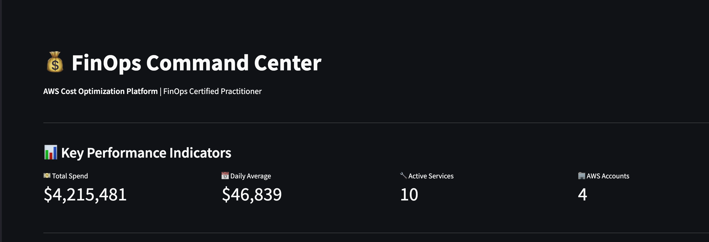
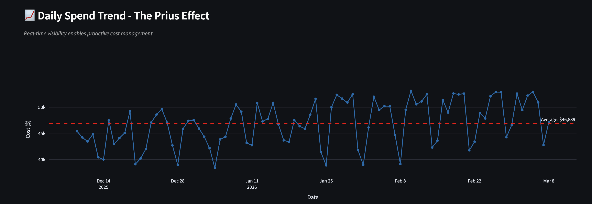
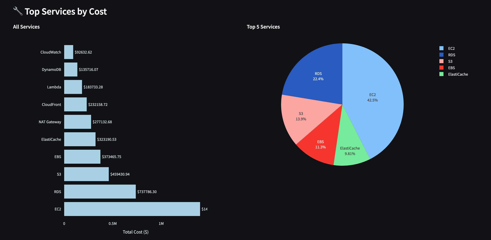
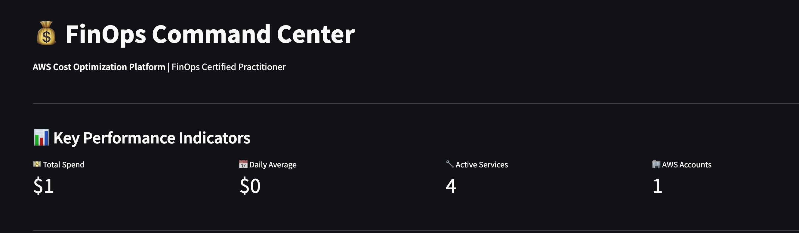
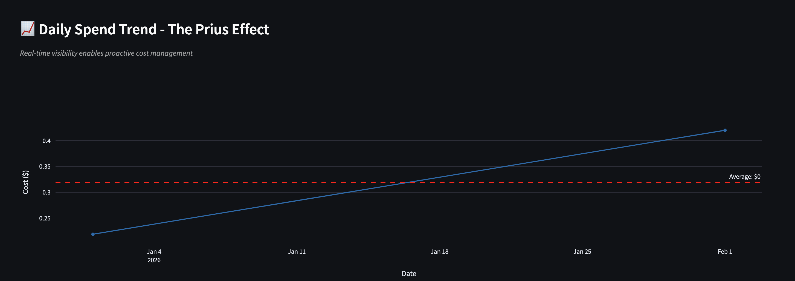
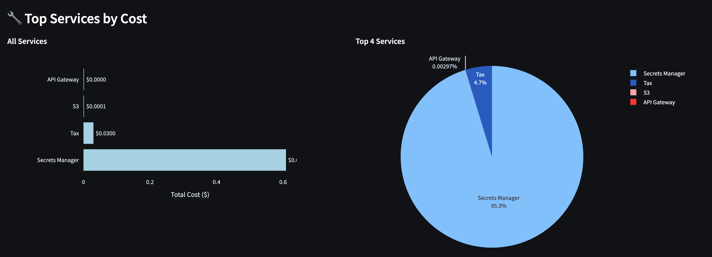

# FinOps Command Center 💰

> **AWS cost optimization platform built by a FinOps Certified Practitioner**

Interactive dashboard for analyzing cloud spending patterns, detecting anomalies, and optimizing AWS costs. Works with both enterprise-scale data and real AWS accounts.



---

## What This Does

This is a working FinOps platform I built to demonstrate cost management at scale. It analyzes AWS spending data and gives you the insights you actually need - where money's going, what's trending up, and when something looks off.

**Key features:**
- Real-time cost visibility across services and accounts
- Anomaly detection (flags spending spikes >20% above baseline)
- Multi-account analysis for organizational chargeback
- Toggle between enterprise-scale demo ($4.2M) and personal AWS data ($0.64)

**Why two data modes?**  
My personal AWS account has minimal spend ($0.64 over 3 months), which is great for learning but doesn't show what this platform can do at scale. So I built realistic simulated data (~$4.2M total) that follows actual AWS spending patterns - EC2-heavy, weekend dips, gradual growth. Best of both worlds: authenticity + real-world scale.

---

## Screenshots

### Enterprise Scale Analysis ($4.2M)

**Key performance indicators:**


**Daily spend tracking with trend analysis:**


**Service-level cost breakdown:**


The enterprise view shows realistic AWS spending patterns - EC2 dominates at 42.5% (compute-heavy workload), RDS at 22.4% (database costs), then storage, networking, and caching services. Weekend dips and daily variation match real production environments.

---

### Personal AWS Account ($0.64)

**My actual AWS account metrics:**


**Real spending growth over 3 months:**


**Actual service breakdown:**


You can see exactly what I'm using - primarily Secrets Manager ($0.61) for credential storage, some AWS tax charges ($0.03), tiny amounts of S3 storage, and API Gateway usage. This is what a learning/development account actually looks like.

---

## Tech Stack

**Built with:**
- **Python** - Data processing and business logic
- **Pandas** - AWS billing data transformation
- **Streamlit** - Interactive web dashboard
- **Plotly** - Professional-grade visualizations
- **AWS Cost Explorer** - Real billing data source

**Why these tools?**  
Streamlit gets you from idea to working dashboard incredibly fast, and Plotly makes charts that actually look good. Perfect combo for a portfolio project that needed to work *and* look professional.

---

## FinOps Concepts Demonstrated

This project isn't just about making charts - it implements real FinOps principles:

**Cost Allocation & Visibility**
- Service-level and account-level spend breakdown
- Multi-account organizational analysis
- Shows exactly where dollars are going

**The Prius Effect**
- Real-time visibility changes behavior (that's the whole point!)
- Daily trend tracking with baseline averages
- Teams can't optimize what they can't see

**Anomaly Detection**
- Automated alerts when spend jumps >20% above 7-day average
- Catches issues before they become problems
- No more surprise bills at month-end

**Metric-Driven Optimization**
- KPIs: Total spend, daily average, service count, account count
- Data-driven decisions instead of gut feelings
- Track improvements over time

---

## How to Run This
```bash
# Clone the repo
git clone https://github.com/tayo214/finops-command-center
cd finops-command-center

# Install dependencies
pip install -r requirements.txt

# Run the dashboard
streamlit run src/app.py
```

The dashboard opens in your browser at `http://localhost:8501`.

**Want to use your own AWS data?**  
Export from AWS Cost Explorer as CSV, drop it in the `data/` folder, and toggle to "Personal Account" view.

---

## Project Structure
```
finops-command-center/
├── src/
│   ├── app.py              # Main dashboard
│   └── prepare_data.py     # Data processing
├── data/
│   ├── simulated_aws_data.csv    # Enterprise demo data
│   ├── aws_billing_services.csv  # My real AWS data
│   └── aws_billing_accounts.csv  # My real AWS data
├── screenshots/            # Dashboard screenshots
└── README.md
```

---

## What I Learned Building This

**The hard parts:**
- AWS Cost Explorer CSV format is... quirky. Service names in column headers, costs in rows, dates all over the place. Took some creative Pandas work to wrangle it into something usable.
- Getting service names to show on charts when you have 4 services vs. 10 services vs. tiny dollar amounts - had to make the visualizations adapt to wildly different scales.
- Balancing "this looks professional" with "this doesn't take 6 months to build."

**The fun parts:**
- Seeing realistic patterns emerge from the simulated data - weekend dips, gradual growth, EC2 dominance. Felt like watching a real company's spending.
- Building something that could actually handle enterprise-scale analysis (even if it's simulated).
- Making a dashboard that doesn't look like every other tutorial project out there.

**What I'd do next:**
- Add RI/CUD coverage analysis (reserved instance optimization)
- Build out unit economics tracking (cost per customer, transaction, etc.)
- Deploy to Streamlit Cloud for live demos

---

## About Me

**Tayo Salako**  
FinOps Certified Practitioner (90% exam score)

I passed the FinOps certification because I'm genuinely interested in how cloud costs work and how to optimize them. This project demonstrates what I learned - not just theory, but actual working code that solves real problems.

**Connect with me:**
- **LinkedIn:** https://www.linkedin.com/in/babatunde-salako-7752a1391/
- **GitHub:** https://github.com/tayo214
- **Email:** babatunde.salako@gmail.com

---

## Certification


Passed with 90% (45/50 questions) - certified in cloud financial management, cost optimization strategies, and organizational FinOps implementation.

---

## License

MIT - feel free to use this for your own FinOps learning!

---

**Built by Tayo Salako** | FinOps Certified Practitioner  
Questions about the project? Want to discuss FinOps strategies? Reach out via [LinkedIn](https://www.linkedin.com/in/babatunde-salako-7752a1391/) or [email](mailto:babatunde.salako@gmail.com) - I'm always happy to talk cloud costs and optimization!